# Архитектура, дерево проекта и ключевые workflows factory-template

Этот документ является каноническим release-facing reference для трёх тем:

1. функциональное назначение `factory-template`;
2. архитектура и дерево репозитория;
3. ключевые workflows, по которым живёт фабрика и generated projects.

Он не заменяет `scenario-pack`, runbooks или launcher scripts.
Детали исполнения остаются в repo-first source-of-truth, а этот документ собирает согласованную карту контуров в одном месте.

## 1. Функциональное назначение проекта

`factory-template` — это русскоязычная фабрика проектов, которая задаёт единый repo-first процесс для:

- greenfield-проектов;
- brownfield-проектов без нормализованного repo;
- brownfield-проектов с уже существующим repo;
- внутренних доработок самой фабрики;
- release-facing сопровождения шаблона и downstream sync.

Практически проект решает пять задач:

1. даёт шаблон нового рабочего repo через `template-repo/`;
2. задаёт сценарный слой через `template-repo/scenario-pack/`;
3. связывает advisory/policy guidance с executable routing для ChatGPT и Codex;
4. фиксирует defect-capture, handoff, verification, closeout и release-followup как обязательные контуры;
5. готовит downstream-consumable документы, export packs, manifests и release bundle.

## 2. Архитектура проекта

### 2.1. Слои

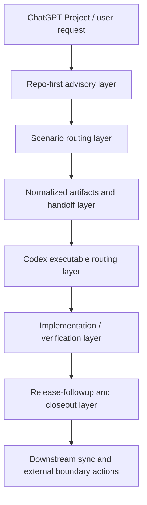

### 2.2. Роли слоёв

- `advisory/policy layer`: `AGENTS`, runbooks, `scenario-pack`, `.chatgpt` guidance, release docs.
- `executable routing layer`: named profiles в `.codex`, `template-repo/codex-routing.yaml`, launcher/router scripts.
- `artifact layer`: `.chatgpt`, reports, changelog/version/release notes, bundle manifests.
- `verification layer`: smoke/examples/matrix/audit/release validators.
- `release-followup layer`: release docs, exports, manifests, boundary actions, verified sync, release executor.

### 2.3. Advisory vs executable

```text
advisory layer
  объясняет, как нужно работать
  не переключает profile/model/reasoning внутри уже открытой сессии

executable routing layer
  выбирает task_class / selected_profile / selected_model
  работает только на границе нового task launch
  фиксирует выбор в `.chatgpt/task-launch.yaml`
```

### 2.4. Handoff / closeout / completion contours

- handoff готовится в ChatGPT или через direct self-handoff и нормализуется в `.chatgpt/*`;
- Codex исполняет remediation и внутренний repo follow-up;
- verification подтверждает green baseline;
- release-followup обновляет docs, exports, manifests и bundle;
- completion package отделяет внутреннюю работу repo от внешних шагов пользователя.

## 3. Дерево проекта и source-of-truth

### 3.1. Схема дерева

```text
factory-template/
├── README.md
├── VERSION.md
├── CHANGELOG.md
├── RELEASE_NOTES.md
├── CURRENT_FUNCTIONAL_STATE.md
├── RELEASE_CHECKLIST.md
├── VERIFY_SUMMARY.md
├── TEST_REPORT.md
├── FACTORY_MANIFEST.yaml
├── template-repo/
│   ├── AGENTS.md
│   ├── README.md
│   ├── VERSION.md
│   ├── CHANGELOG.md
│   ├── TEMPLATE_MANIFEST.yaml
│   ├── codex-routing.yaml
│   ├── scenario-pack/
│   ├── process/
│   ├── scripts/
│   └── template/
├── docs/
│   ├── template-architecture-and-event-workflows.md
│   └── releases/
├── factory_template_only_pack/
├── meta-template-project/
├── packaging/sources/
├── registry/
├── reports/
├── tools/
├── work/
├── optional-domain-packs/
├── working-project-examples/
└── workspace-packs/
```

### 3.2. Назначение ключевых каталогов

- repo root: release-facing входная зона и versioning layer фабрики.
- `template-repo/`: source-of-truth шаблона generated projects.
- `template-repo/scenario-pack/`: canonical scenario routing.
- `template-repo/process/`: policies и definition-of-done.
- `template-repo/scripts/`: launcher, validators, sync/release automation.
- `template-repo/template/`: scaffold, который materialize-ится в downstream project.
- `docs/`: канонические обзорные reference-docs без дублирования сценарного слоя.
- `factory_template_only_pack/`: operator/codex runbooks и boundary/completion guidance.
- `meta-template-project/`: контур развития самой фабрики и release-facing meta notes.
- `packaging/sources/`: declarative source/export profiles.
- `registry/`: release history, versions, projects created.
- `reports/`: bug reports и factory feedback.
- `work/completed/`: закрытые work items.
- `optional-domain-packs/`: optional reference-cases, не входящие в canonical core tree.
- `working-project-examples/`: golden fixtures и compatibility examples.
- `workspace-packs/`: optional downstream operational tooling.

### 3.3. Что считать source-of-truth

- для repo-first правил внутри текущего repo: root `AGENTS.md`;
- для downstream `AGENTS`: `template-repo/AGENTS.md`;
- для сценарной маршрутизации: `template-repo/scenario-pack/`;
- для routing execution: `template-repo/codex-routing.yaml` и launcher/router scripts;
- для release state: `VERSION.md`, `CHANGELOG.md`, `RELEASE_NOTES.md`, `CURRENT_FUNCTIONAL_STATE.md`;
- для verify/closeout: `.chatgpt/verification-report.md`, `.chatgpt/done-report.md`, `.chatgpt/task-index.yaml`, `.chatgpt/task-launch.yaml`.

## 4. Workflow map

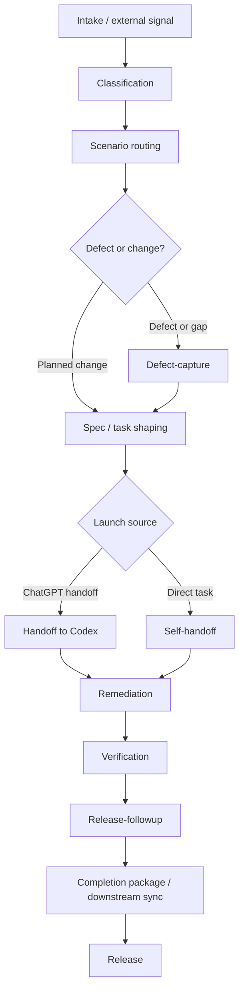

Ниже каждый workflow описан в одном формате:

- входы;
- выходы;
- артефакты;
- gate’ы;
- схема;
- пошаговое описание.

## 5. Workflow: intake / classification

### Входы

- новый запрос пользователя;
- внешний сигнал из GitHub/ChatGPT/operator loop;
- direct Codex task;
- release-followup task.

### Выходы

- выбранный project profile;
- выбранный сценарий;
- текущий pipeline stage;
- список артефактов для обновления;
- решение, разрешён ли handoff.

### Артефакты

- `template-repo/scenario-pack/00-master-router.md`
- `.chatgpt/task-launch.yaml`
- `.chatgpt/task-index.yaml`

### Gate’ы

- `intake_complete`
- `classification_complete`

### Схема

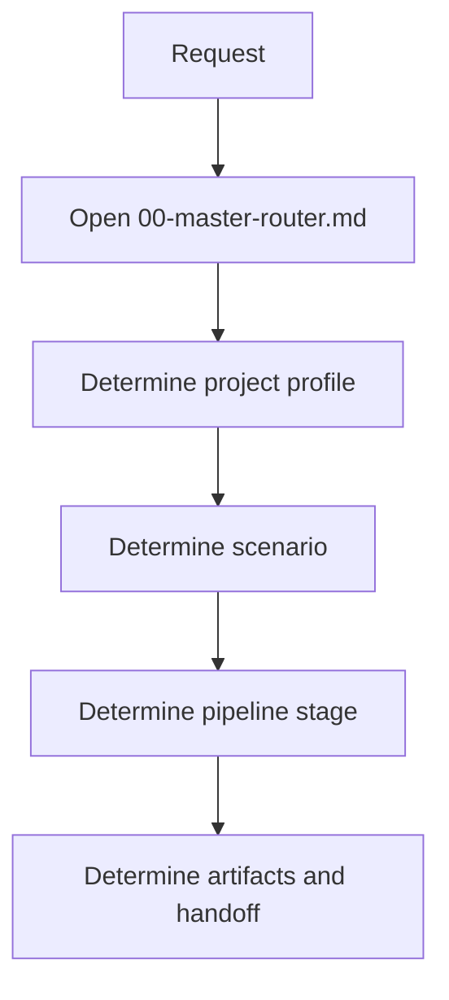

### Шаги

1. Открыть `template-repo/scenario-pack/00-master-router.md`.
2. Зафиксировать, что repo rules прочитаны из repo, а не из памяти.
3. Классифицировать запрос: change, bug, audit, release-followup, direct task.
4. Определить project profile и scenario route.
5. Зафиксировать pipeline stage и обязательные артефакты.
6. Отдельно определить, есть ли handoff boundary или direct self-handoff.

## 6. Workflow: scenario routing

### Входы

- результаты classification;
- `scenario-pack`;
- project/policy presets;
- brownfield or greenfield context.

### Выходы

- маршрут чтения repo-файлов;
- минимально достаточный набор сценариев;
- ясное разделение advisory и executable layers.

### Артефакты

- `template-repo/scenario-pack/*.md`
- `template-repo/project-presets.yaml`
- `template-repo/policy-presets.yaml`
- `template-repo/change-classes.yaml`

### Gate’ы

- `reuse_check_complete`
- `reality_check_complete`
- `conflict_detection_complete`

### Схема

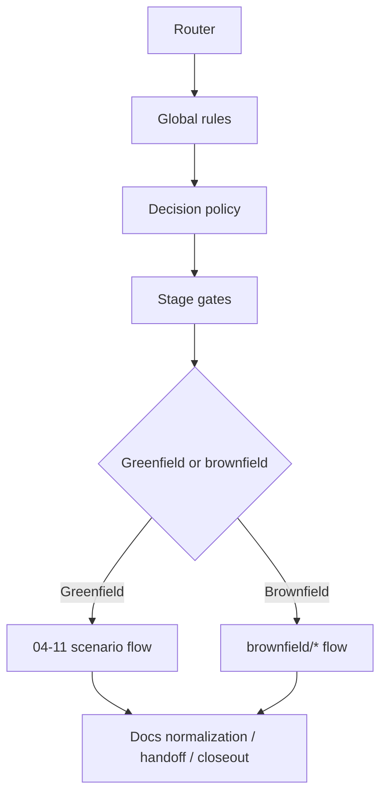

### Шаги

1. Прочитать router.
2. Прочитать общие правила и policy/gate-файлы.
3. Перейти в greenfield или brownfield ветку.
4. Прочитать только те сценарии, которые реально нужны текущей задаче.
5. Перед реализацией убедиться, что аналитический маршрут завершён и artifacts нормализованы.

## 7. Workflow: defect-capture

### Входы

- bug, gap, regression, inconsistency, reusable process failure;
- incidental defect, найденный во время другого change.

### Выходы

- bug report;
- defect classification;
- factory feedback, если defect reusable.

### Артефакты

- `reports/bugs/*.md`
- `reports/factory-feedback/*.md`
- `.chatgpt/verification-report.md`
- `.chatgpt/done-report.md`

### Gate’ы

- дефект не должен быть silently dropped;
- remediation допускается только после evidence и classification.

### Схема

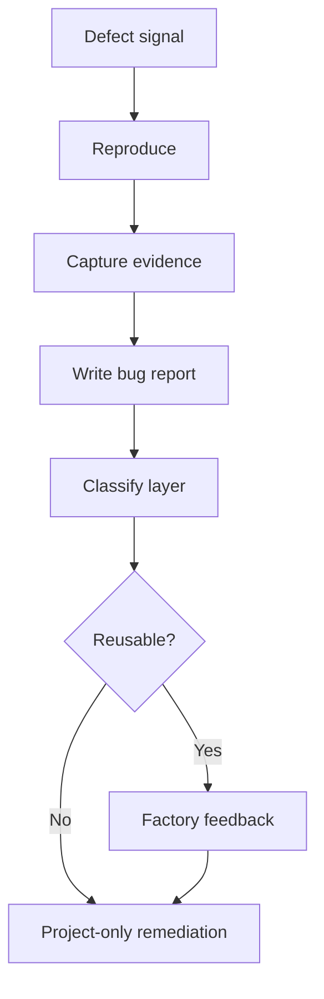

### Шаги

1. Воспроизвести проблему или зафиксировать наблюдаемое расхождение.
2. Собрать evidence.
3. Записать bug report.
4. Классифицировать defect: `project-only`, `factory-template`, `shared/unknown`.
5. Если defect reusable, подготовить factory feedback.
6. Только после этого переходить к remediation либо к отдельному handoff.

## 8. Workflow: handoff в Codex

### Входы

- подготовленные specs и evidence;
- `codex_handoff_allowed = true`;
- достаточная определённость задачи.

### Выходы

- один цельный copy-paste handoff block;
- нормализованные `.chatgpt` artifacts;
- launch metadata.

### Артефакты

- `.chatgpt/codex-input.md`
- `.chatgpt/codex-context.md`
- `.chatgpt/codex-task-pack.md`
- `.chatgpt/normalized-codex-handoff.md`
- `.chatgpt/task-launch.yaml`

### Gate’ы

- `spec_validated`
- `tech_spec_validated`
- `task_validation_complete`
- `codex_handoff_allowed`

### Схема

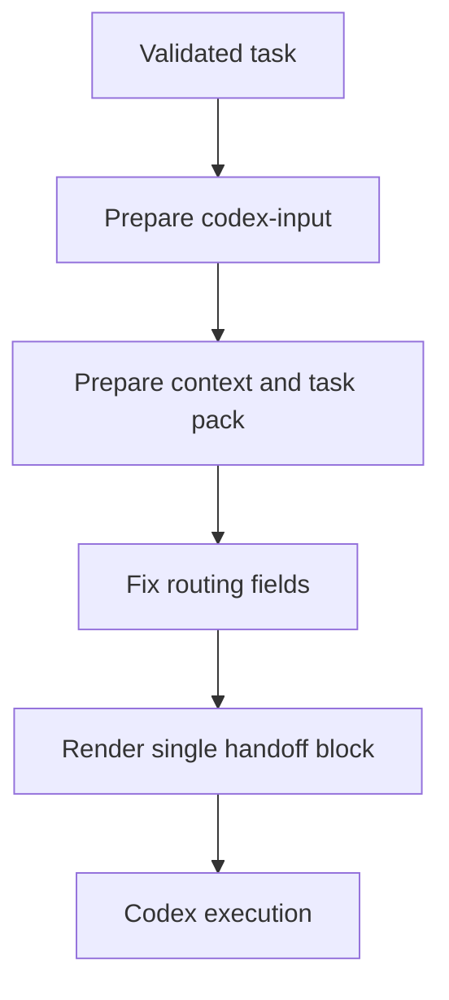

### Шаги

1. Подготовить `codex-input.md`.
2. Зафиксировать контекст, route и artifacts.
3. Указать priority repo rules и ограничения scope.
4. Выдать пользователю только один handoff block.
5. Не заменять handoff ссылкой на файл.

## 9. Workflow: self-handoff для direct task

### Входы

- задача пришла напрямую в Codex;
- отсутствует внешний ChatGPT handoff.

### Выходы

- visible self-handoff block в первом substantive ответе;
- обновлённые launch artifacts.

### Артефакты

- `.chatgpt/direct-task-self-handoff.md`
- `.chatgpt/direct-task-response.md`
- `.chatgpt/task-launch.yaml`

### Gate’ы

- direct task не может сразу переходить к коду;
- route выбирается только на новом task launch.

### Схема

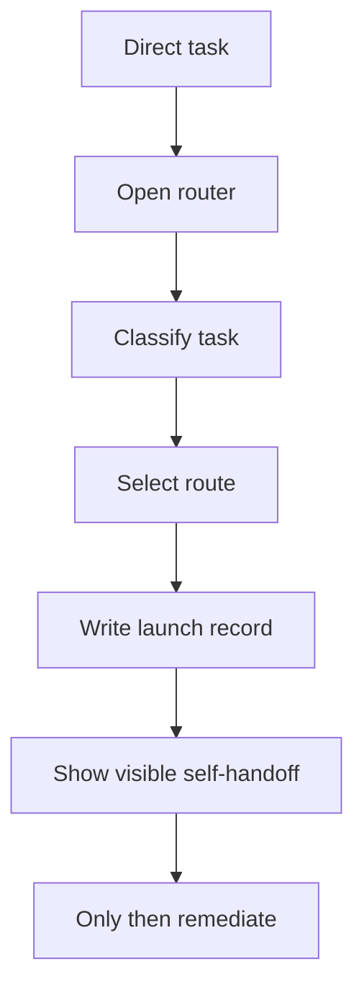

### Шаги

1. Открыть router.
2. Классифицировать задачу.
3. Выбрать profile/model/reasoning через executable layer.
4. Зафиксировать launch record.
5. Показать пользователю self-handoff.
6. Только потом переходить к implementation/review.

## 10. Workflow: remediation

### Входы

- handoff или self-handoff;
- нормализованный scope;
- bug report, если был defect.

### Выходы

- кодовые и документальные изменения;
- обновлённые canonical artifacts;
- при необходимости incidental defect records.

### Артефакты

- любые затронутые repo files;
- `.chatgpt/task-index.yaml`
- `work/completed/*.md`

### Gate’ы

- реализация не должна противоречить repo-first rules;
- silent fixes запрещены;
- найденные incidental bugs должны быть зафиксированы.

### Схема

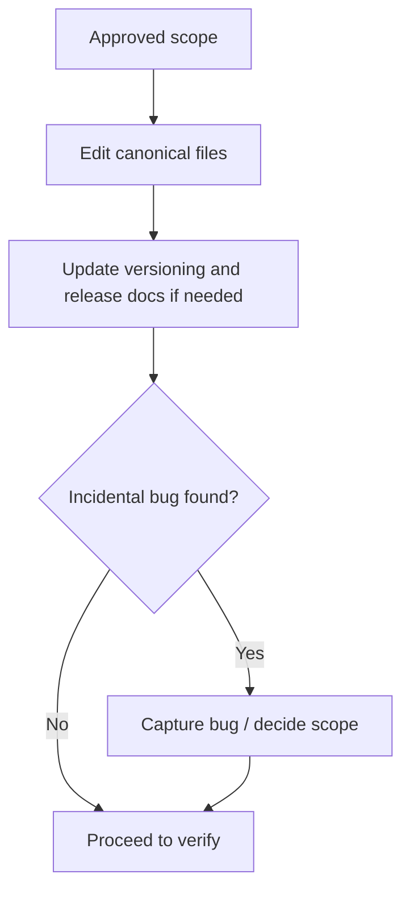

### Шаги

1. Изменять только канонические файлы.
2. Не плодить параллельные source-of-truth.
3. Если change release-facing, синхронизировать versioning layer сразу.
4. Если обнаружен incidental bug, отдельно решить его маршрут.

## 11. Workflow: verification

### Входы

- завершённая remediation;
- актуальные closeout/release artifacts.

### Выходы

- green verify baseline;
- verification report;
- решение о ready/not ready for release-followup.

### Артефакты

- `.chatgpt/verification-report.md`
- `VERIFY_SUMMARY.md`
- `TEST_REPORT.md`
- `.chatgpt/stage-state.yaml`

### Gate’ы

- `verification_complete`

### Схема

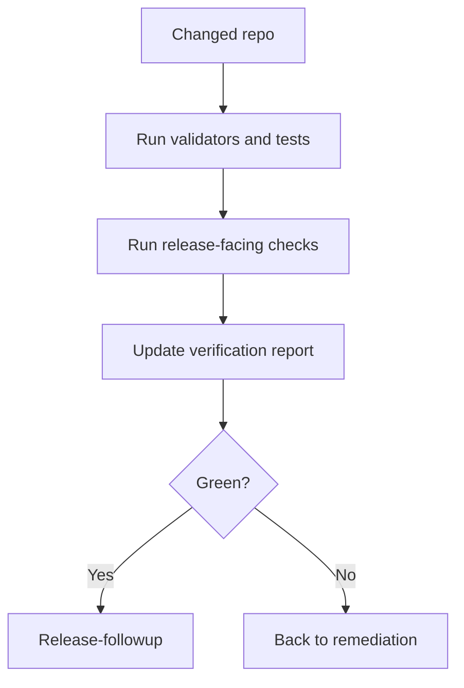

### Шаги

1. Прогнать релевантные validators/tests.
2. Проверить release-facing consistency.
3. Обновить `verification-report.md`.
4. Если verify не green, вернуться в remediation.

## 12. Workflow: release-followup

### Входы

- green verify;
- release-eligible diff;
- versioning layer ready.

### Выходы

- согласованные release docs;
- refreshed manifests/exports;
- release bundle artifacts;
- verified sync and release decision artifacts.

### Артефакты

- `VERSION.md`
- `CHANGELOG.md`
- `RELEASE_NOTES.md`
- manifests
- source/export profiles
- bundle artifacts

### Gate’ы

- внутренний release-followup не должен перекладываться на пользователя;
- `done_complete` нельзя считать закрытым без внутреннего repo prep.

### Схема

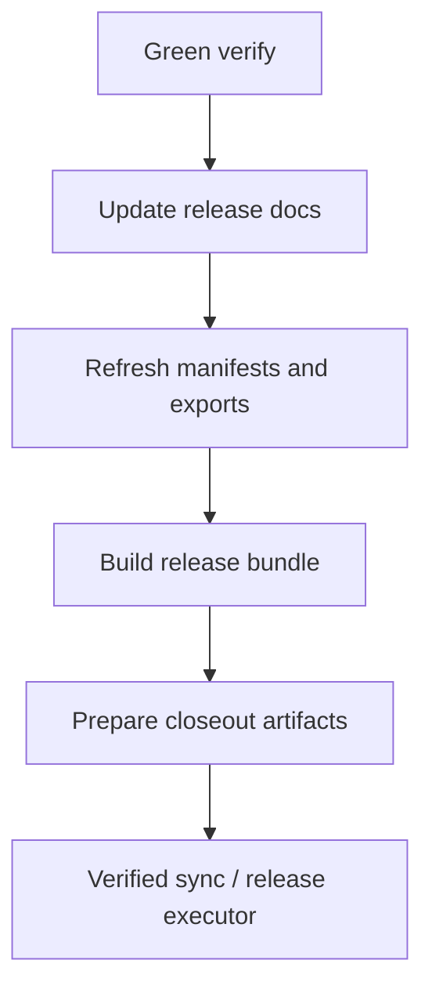

### Шаги

1. Поднять версию и синхронизировать manifests.
2. Обновить changelog, release notes и functional state.
3. Обновить export/source manifests.
4. Собрать release bundle и auxiliary artifacts.
5. Подготовить `.chatgpt` closeout.

## 13. Workflow: completion package / optional Sources fallback / downstream sync

### Входы

- release-facing change, затрагивающий downstream-consumed content;
- готовые repo-side exports и boundary instructions.

### Выходы

- completion package для пользователя;
- разделение на internal и external contours;
- готовые артефакты для скачивания/замены.

### Артефакты

- `_artifacts/...`
- patch/export bundles
- generated boundary actions
- финальный ответ пользователю

### Gate’ы

- внешний шаг допускается только после внутреннего repo prep;
- если контур не затронут, это нужно сказать явно.

### Схема

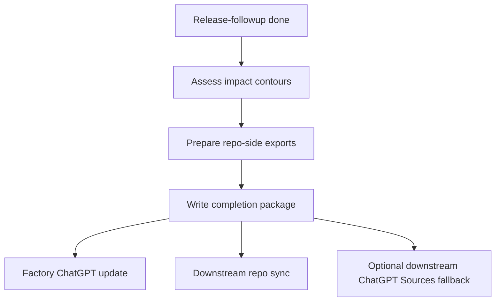

### Шаги

1. Определить impact contours.
2. Собрать готовые artifacts внутри repo.
3. Явно разделить:
   - обновление factory-template ChatGPT Project instruction;
   - обновление downstream/battle repos;
   - обновление downstream/battle ChatGPT Project instructions.
4. Добавить delete-before-replace semantics.
5. Для `hot15` учитывать flat folder без подпапок.
6. Не предлагать refresh `Sources` как default path: он допустим только для legacy/hybrid проектов, которые ещё не работают полностью в repo-first режиме.

## 14. Workflow: incidental bugs

### Входы

- побочный defect, найденный внутри основного change.

### Выходы

- defect closure inside current scope;
- либо bug report + self-handoff;
- либо research prompt.

### Артефакты

- bug report
- factory feedback при reusable issue
- self-handoff notes

### Gate’ы

- incidental bug нельзя silently drop;
- если route меняется, canonical path — новый task launch.

### Схема

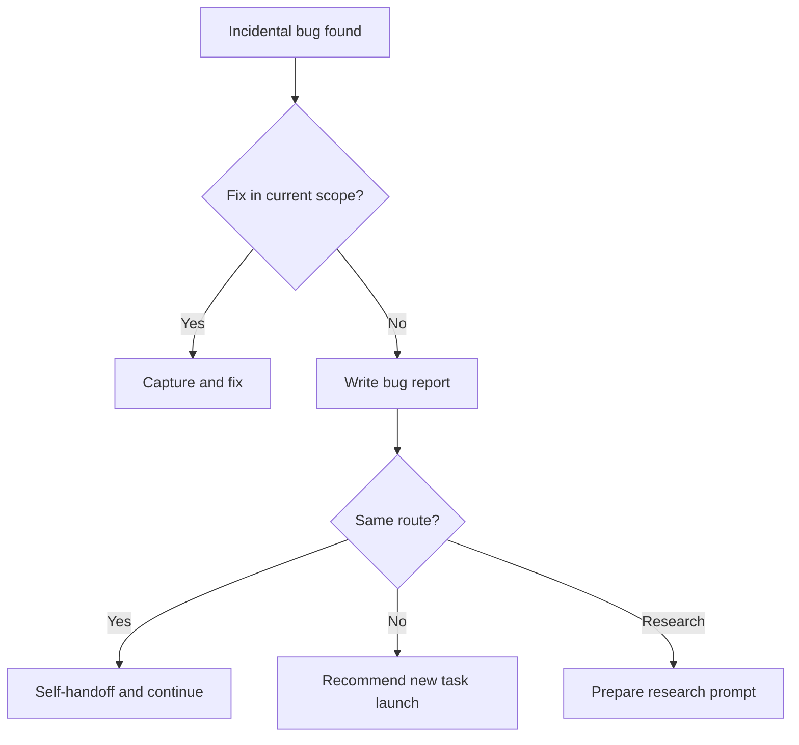

### Шаги

1. Зафиксировать bug.
2. Решить, можно ли исправить его в текущем scope.
3. Если нет, подготовить отдельный route decision.
4. Если нужен другой profile/model/reasoning, рекомендовать новый task launch.

## 15. Workflow: выпуск релиза

### Входы

- verify green;
- release docs готовы;
- `release-decision.yaml` заполнен;
- sync prereqs пройдены.

### Выходы

- verified sync report;
- release report;
- tag/release publication or manual fallback instructions.

### Артефакты

- `.factory-runtime/reports/verified-sync-report.yaml`
- `.factory-runtime/reports/release-report.yaml`
- `.chatgpt/release-decision.yaml`
- release bundle zip

### Gate’ы

- verified sync должен быть выполнен или зафиксирован реальный blocker;
- release executor работает только после актуального sync report.

### Схема

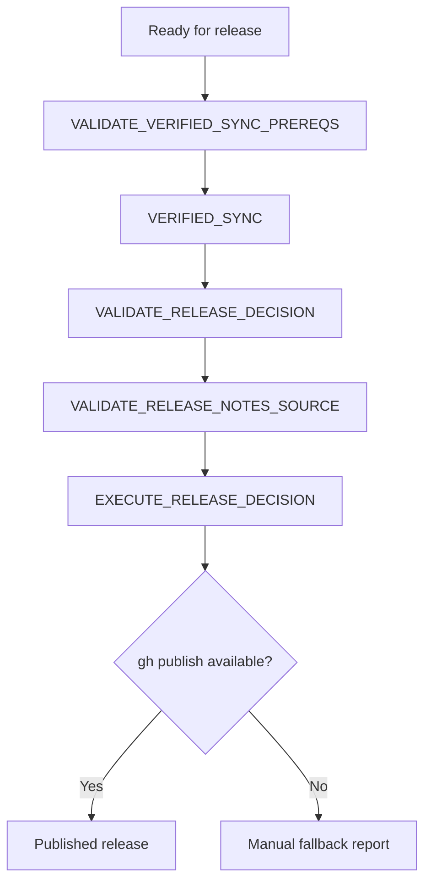

### Шаги

1. Подтвердить green verify и clean release docs.
2. Выполнить verified sync.
3. Провалидировать release decision и release notes source.
4. Запустить release executor.
5. Если `gh` недоступен или не авторизован, использовать manual fallback из release report.

## 16. Итог канона

Канонический release-facing набор для описания `factory-template` теперь распределён так:

- `README.md`: назначение проекта, режимы входа, operator-facing старт;
- `docs/template-architecture-and-event-workflows.md`: архитектура, дерево проекта и workflows;
- `RELEASE_NOTES.md`: текущий релиз;
- `VERSION.md`, `CHANGELOG.md`, `CURRENT_FUNCTIONAL_STATE.md`: versioning and current-state layer;
- `factory_template_only_pack/*.md`: практические runbooks и completion guidance;
- `template-repo/scenario-pack/`: исполнимый сценарный source-of-truth.
